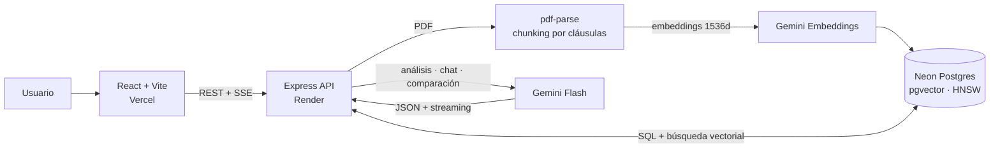

# ContractLens

[](https://github.com/marwix127/ContractLens/actions/workflows/ci.yml)

[English](README.md) · **Español**

Asistente de análisis de contratos. Convierte un PDF en una vista estructurada:
resumen ejecutivo, datos clave, riesgos ordenados por severidad y un chat que
responde citando la página y la cláusula de donde sale la respuesta.

La idea es centralizar la primera lectura de un contrato, para que un despacho
pequeño pueda ver las partes, las fechas, las obligaciones y las cláusulas que
merecen una revisión profesional sin tener que leérselo entero antes.

## Demo

[Demo en vivo](https://contract-lens-mwx.vercel.app) ·
[API REST](https://contractlens-api-o8wt.onrender.com) ·
[Estado del servicio](https://contractlens-api-o8wt.onrender.com/health)

La demo pública tiene el frontend en Vercel, la API en Render y PostgreSQL +
pgvector en Neon. Viene con cinco contratos ficticios ya cargados, así que se
puede recorrer el producto sin subir documentación propia.

**ContractLens genera un análisis automatizado con fines informativos. No
sustituye el asesoramiento de un profesional legal.**

## Capturas

[](https://contract-lens-mwx.vercel.app)

Resumen ejecutivo, partes, fechas, condiciones clave y el chat RAG en una sola vista.

[](https://contract-lens-mwx.vercel.app)

Cada riesgo conserva su ubicación, su explicación, su severidad y su recomendación.

Hay dos más: la [portada](docs/images/contractlens-home.png) y el
[visor del documento](docs/images/contractlens-document.png). Todas usan los
contratos ficticios que vienen con la demo.

## Arquitectura



En la ingesta, el PDF se extrae página a página, se parte en chunks por los
límites de cláusula, se embebe y se guarda en pgvector. Ante una pregunta se
recuperan los chunks top-k y se le pasan a Gemini, que devuelve la respuesta con
citas por streaming.

## Stack técnico

**Backend**, Node.js y Express:

- `pg` con la extensión **pgvector**, para búsqueda vectorial dentro de Postgres
- `pdf-parse` (v2) para extraer el texto página a página
- `@google/genai` para embeddings, análisis y chat
- `multer` para gestionar las subidas en memoria

**Frontend**, React 19 con Vite y Tailwind CSS 4, más `react-pdf` para el visor
integrado (con carga diferida).

**Infraestructura**:

- Docker Compose para reproducir PostgreSQL + pgvector en local
- Render para la API, con el runtime nativo de Node.js
- Neon para el PostgreSQL administrado, con conexión agrupada y TLS
- Vercel para el frontend
- Archivos de entorno separados para local (`.env.local`) y para despliegue

**Modelos de Gemini**: `gemini-embedding-001` a 1536 dimensiones para los
embeddings, y `gemini-3.5-flash` para análisis, chat y comparación, con fallback
a `gemini-3-flash-preview` y `gemini-2.5-flash`.

## Decisiones técnicas

**Un solo proveedor para todo.** Embeddings, análisis y chat pasan por Gemini,
así que hay un único origen de cuota y credenciales que gestionar. Cada tarea
sigue viviendo en su propio servicio, lo que abarata el cambio si más adelante
se mueve el modelo o el proveedor.

**pgvector en vez de una base vectorial dedicada.** Para este volumen, mantener
los vectores junto a los datos relacionales elimina una pieza de infraestructura
y hace triviales los joins entre chunk y contrato. El índice es HNSW con
distancia coseno: se puede crear antes de cargar nada y da buen recall sobre un
conjunto pequeño que crece de forma incremental.

**1536 dimensiones, normalizadas a mano.** `gemini-embedding-001` devuelve 3072
dimensiones por defecto, pero una columna `vector` indexada con HNSW admite hasta
2000. El servicio pide `outputDimensionality: 1536` y, como Gemini no vuelve a
normalizar un vector truncado, la normalización se hace en código para que la
distancia coseno siga significando algo. Al indexar se usa `RETRIEVAL_DOCUMENT`
como `taskType` y en las preguntas `RETRIEVAL_QUERY`.

**Chunking por cláusulas, no solo por tamaño.** Los encabezados de cláusula y
artículo se detectan con una regex y el texto se corta en esos límites,
conservando en cada chunk el número de página y la referencia de la cláusula. Eso
es lo que luego cita el chat. Las cláusulas demasiado largas se subdividen con
solapamiento.

**Structured output en el análisis.** El análisis inicial le pide a Gemini un
JSON contra un esquema, en lugar de extraer los datos de una respuesta libre.

**RAG con citas y un "no lo sé" explícito.** El chat recupera los fragmentos más
relevantes y responde citando página y cláusula. Cuando la respuesta no está en
el documento lo dice, lo que reduce las respuestas inventadas. Mantiene el
historial y emite por Server-Sent Events.

**Cadena de modelos con fallback.** Ante un 429 o un 503 la petición pasa al
siguiente modelo de la cadena. El 503 se reintenta antes con backoff, porque
suele significar saturación; el 429 significa que la cuota se acabó, así que
reintentar el mismo modelo no sirve de nada y se salta directamente. Análisis,
chat y comparación comparten el mecanismo. Ayuda cuando hay saturación, pero no
salva nada si fallan todos los modelos de la cadena.

**Límites en la demo pública.** Las subidas y todas las llamadas a Gemini
comparten límites por IP, además de cuotas globales de ráfaga y diarias y un
máximo de tres operaciones de IA concurrentes. El `429` vuelve con cabeceras
`RateLimit` y `Retry-After`. `/health` queda excluido y cachea brevemente su
comprobación de Neon. Los PDFs se limitan a 5 MB y 100 páginas, las preguntas a
2000 caracteres, y un análisis ya guardado se reutiliza en vez de volver a
gastar cuota.

**Comparación de versiones.** Dos contratos entran en una única llamada con
structured output que devuelve los cambios, cada uno marcado como añadido,
eliminado o modificado con su impacto y sus valores antes y después, más cómo
cambia el perfil de riesgo.

## Calidad y CI

La suite levanta la misma aplicación Express sobre un puerto efímero, pero con
una base de datos y unos servicios de IA falsos inyectados. Cubre CORS, health y
readiness, límites JSON y multipart, privacidad del listado, análisis cacheado,
descarga Unicode, limpieza tras una ingesta fallida, SSE y rate limiting. Sin
secretos y sin gastar cuota externa.

GitHub Actions ejecuta en paralelo los tests del backend y el build de producción
del frontend con Node 22, en cada push y pull request a `master`.

## Estructura del proyecto

```
ContractLens/
├── .github/workflows/ci.yml  # tests y build en GitHub Actions
├── compose.yaml              # PostgreSQL + pgvector para desarrollo local
├── index.js                  # composición y ciclo de vida del servidor
├── src/
│   ├── app.js                # fábrica Express, testeable sin abrir puertos
│   ├── db.js                 # pool de conexión a Postgres
│   ├── http/                 # headers, límites y control de concurrencia
│   ├── routes/contracts.js   # endpoints
│   └── services/
│       ├── gemini.js         # cliente Gemini, creado en el primer uso
│       ├── embeddings.js     # embeddings de Gemini, normalizados
│       ├── chunking.js       # chunking por cláusulas
│       ├── ingest.js         # chunks, embeddings e inserción en pgvector
│       ├── analysis.js       # análisis inicial con structured output
│       ├── chat.js           # retrieval y respuesta RAG, normal y streaming
│       └── retry.js          # fallback de modelos y backoff para Gemini
├── migrations/               # schema y migraciones
├── test/                     # pruebas unitarias e integración HTTP
├── seed/
│   ├── seed-samples.js       # muestras completas, generadas con Gemini
│   └── seed-local.js         # datos QA deterministas, sin llamar a Gemini
└── frontend/                 # React + Vite + Tailwind
    └── src/
        ├── api.js
        └── components/       # UploadScreen, ContractView, Dashboard, ChatPanel, PdfViewer
```

## Puesta en marcha

Hace falta Node.js 22 LTS (22.12+) y Docker Desktop con Docker Compose para la
opción local. Una [API key de Gemini](https://aistudio.google.com/apikey) solo es
necesaria para subidas, embeddings, análisis, chat y comparación reales.

### Backend local con Docker

```bash
npm install
cp .env.local.example .env.local

# PostgreSQL 16 con pgvector, publicado en localhost:5433
npm run local:db:up

# Esquema y dos contratos deterministas para QA
npm run local:migrate
npm run local:seed

# API en http://localhost:3000
npm run local:dev
```

En PowerShell, usa `Copy-Item` para la configuración:

```powershell
Copy-Item .env.local.example .env.local
```

En otra terminal, arranca el frontend:

```bash
cd frontend
npm install
npm run dev
```

La aplicación queda en `http://localhost:5173`, y Vite reenvía `/contracts` al
backend del puerto 3000. Para comprobar que todo está conectado:

```text
GET http://localhost:3000/          -> Express está arriba
GET http://localhost:3000/health    -> Express y PostgreSQL están arriba
GET http://localhost:3000/contracts/samples
```

El seed local no gasta cuota de Gemini y deja listos el listado, el dashboard, el
visor y la exportación a PDF. Subir contratos nuevos, usar el chat o comparar
versiones requiere `GEMINI_API_KEY` en `.env.local`. Ojo con que los contratos
del seed no llevan embeddings, así que para probar el chat RAG completo hay que
subir un PDF con una clave configurada.

### Configuración manual o remota

También sirve cualquier PostgreSQL con la extensión `pgvector`. Crea un `.env`
con `DATABASE_URL`, `GEMINI_API_KEY`, `PORT` y `FRONTEND_URL`, y ejecuta:

```bash
npm run migrate
npm run db:check
npm run seed
npm run dev
```

Cuidado con `npm run seed`: genera las muestras completas y sí llama a Gemini.

### Scripts

| Script | Qué hace |
|--------|----------|
| `npm test` | Toda la suite, sin Neon y sin llamar a Gemini |
| `npm run test:unit` | Pruebas unitarias de headers y rate limiting |
| `npm run test:integration` | API Express completa con DB e IA falsas |
| `npm run local:db:up` | Levanta el PostgreSQL + pgvector local |
| `npm run local:migrate` | Aplica el esquema a la base local |
| `npm run local:seed` | Datos QA deterministas, sin Gemini |
| `npm run local:dev` | Backend local con recarga automática |
| `npm run migrate:hnsw` | Pasa una base anterior de IVFFlat a HNSW |
| `npm run db:reset` | Vacía todos los datos de la base configurada |
| `npm run seed` | Regenera las muestras completas usando Gemini |

`npm run local:db:down` para la base de datos. Los datos siguen en el volumen
`contractlens_pgdata`; `docker compose down -v` elimina también ese volumen, así
que solo conviene usarlo para reiniciar la base local desde cero.

## Despliegue

El objetivo mantiene el frontend en Vercel, la API Express en Render y
PostgreSQL + pgvector en Neon.

### 1. Base de datos en Neon

1. Crea un proyecto de Neon en una región europea próxima a Frankfurt.
2. En **Connect**, copia primero la URL directa. Esa es la de las migraciones.
3. Copia `.env.example` como `.env`, pon esa URL en `DATABASE_URL` y completa el
   resto de variables.
4. Apunta a ese archivo expresamente, porque `.env.local` tiene prioridad en
   desarrollo:

```bash
ENV_FILE=.env npm run migrate
ENV_FILE=.env npm run db:check
```

En PowerShell:

```powershell
$env:ENV_FILE='.env'
npm.cmd run migrate
npm.cmd run db:check
```

La migración activa `vector` y crea el esquema. Para la API desplegada usa la URL
**pooled** de Neon y conserva sus parámetros de seguridad. Si Neon entrega
`sslmode=require`, la configuración lo normaliza a `sslmode=verify-full` antes de
crear el pool.

### 2. Backend en Render

El repositorio incluye un `render.yaml`, así que la configuración del servicio
queda versionada y no hay que introducir nada a mano.

1. En Render, selecciona **New > Blueprint** y conecta este repositorio.
2. Render detecta `render.yaml`. Revisa el servicio `contractlens-api` y confirma
   el plan **Free** y la región **Frankfurt**.
3. Cuando Render lo pida, configura los dos secretos:

```text
DATABASE_URL=<URL pooled de Neon>
GEMINI_API_KEY=<clave de Google AI Studio>
```

El Blueprint fija `NODE_ENV`, `FRONTEND_URL`, Node 22, `npm ci`, `npm start` y el
health check `/health`, y Render aporta `PORT` por su cuenta. No uses la base de
datos de Render: la aplicación se queda en la URL pooled de Neon.

### 3. Frontend en Vercel

Pon el directorio raíz en `frontend` (el preset de Vite se autodetecta) y añade
una variable de entorno, `VITE_API_BASE`, con el dominio
`https://...onrender.com` del backend y sin barra final. Se incorpora durante el
build, así que después de cambiarla hay que redesplegar y comprobar `/health`, la
lista de ejemplos y CORS.

## API

| Método | Ruta | Descripción |
|--------|------|-------------|
| `GET`  | `/health` | Comprueba que la API y PostgreSQL están disponibles |
| `POST` | `/contracts` | Sube un PDF en el campo `file`, y lo extrae, trocea e indexa |
| `GET`  | `/contracts` | Solo las muestras; `.env.local.example` habilita el listado local completo |
| `GET`  | `/contracts/samples` | Lista los contratos de muestra |
| `GET`  | `/contracts/:id` | Detalle de un contrato |
| `GET`  | `/contracts/:id/file` | Sirve el PDF original |
| `POST` | `/contracts/:id/analyze` | Genera y guarda el análisis |
| `GET`  | `/contracts/:id/analysis` | Devuelve el análisis guardado |
| `GET`  | `/contracts/:id/analysis/pdf` | Descarga el análisis como informe PDF |
| `POST` | `/contracts/:id/chat` | Pregunta sobre el contrato, respuesta completa |
| `POST` | `/contracts/:id/chat/stream` | Lo mismo, por streaming SSE |
| `POST` | `/contracts/compare` | Compara dos versiones, `fromId` y `toId` |

## Limitaciones conocidas

La instancia gratuita de Render se suspende tras 15 minutos sin tráfico y puede
tardar cerca de un minuto en responder a la primera petición. Neon también puede
tener que despertar, y un PDF grande puede agotar el tiempo disponible para una
única petición síncrona.

La demo es compartida y todavía no tiene autenticación ni aislamiento por
usuario. El listado público solo devuelve las muestras y hay rate limiting, pero
los documentos subidos quedan almacenados. No conviene usar contratos reales o
confidenciales; antes de un uso comercial harían falta cuentas y una política de
retención y borrado.

Los contadores del rate limiting son una protección best effort. Viven en
memoria, porque la demo corre en una única instancia, y se reinician cuando
Render suspende, reinicia o redespliega el servicio. Proteger un presupuesto real
o escalar más allá de una instancia obligaría a moverlos a un almacén compartido
y persistente.

Las cuotas de Gemini dependen del modelo, el proyecto y el tier. Cuando un
intento devuelve 429, la cadena de fallback prueba el siguiente modelo. Los
análisis guardados se reutilizan, pero subir un PDF, conversar o comparar
versiones sí gasta recursos de IA.

El chunking por regex está pensado para contratos en español bien estructurados
(Cláusula/Artículo/Estipulación), y los PDFs escaneados sin OCR no tienen texto
extraíble, así que se rechazan con un aviso.
