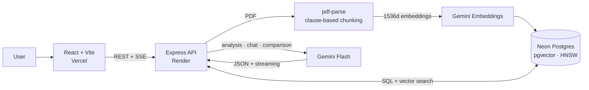

# ContractLens

[](https://github.com/marwix127/ContractLens/actions/workflows/ci.yml)

**English** · [Español](README.es.md)

> AI-powered contract analysis assistant. Turns a PDF into a structured view with an executive summary, key facts, risks ranked by severity, and a chat that cites page and clause.

**The problem it solves:** it centralises the first read of a contract so that
small law firms and SMEs can quickly locate the parties, dates, obligations and
clauses that deserve a professional review.

---

## Demo

[Live demo](https://contract-lens-mwx.vercel.app) ·
[REST API](https://contractlens-api-o8wt.onrender.com) ·
[Service status](https://contractlens-api-o8wt.onrender.com/health)

The public demo connects Vercel to the API on Render and PostgreSQL + pgvector on
Neon. It ships with five preloaded fictional contracts so you can explore the
product without uploading anything of your own.

> ⚠️ ContractLens provides automated analysis for informational purposes only. **It is not a substitute for advice from a legal professional.**

---

## The product in action

[](https://contract-lens-mwx.vercel.app)

_Executive summary, parties, dates, key terms and RAG chat in a single view._

[](https://contract-lens-mwx.vercel.app)

_Every risk keeps its location, explanation, severity and recommendation._

[See the landing page](docs/images/contractlens-home.png) ·
[See the document viewer](docs/images/contractlens-document.png)

All screenshots use the fictional contracts bundled with the public demo.

---

## Architecture



- **Ingestion:** PDF → page-by-page extraction → structural chunking → embeddings → pgvector.
- **Query:** question → _top-k_ retrieval → Gemini → SSE response with citations.

---

## Tech stack

**Backend** — Node.js + Express
- `pg` + the **pgvector** extension — Postgres with vector search
- `pdf-parse` (v2) — page-by-page text extraction
- `@google/genai` — embeddings, analysis and chat with Gemini
- `multer` — in-memory file uploads

**Frontend** — React 19 + Vite + Tailwind CSS 4
- `react-pdf` — built-in PDF viewer (lazy-loaded)

**Infrastructure**
- PostgreSQL + pgvector reproducible locally via **Docker Compose**
- Backend deployable to **Render** on the native Node.js runtime
- Managed PostgreSQL on **Neon** with connection pooling and TLS
- Frontend hosted on **Vercel**
- Separate environment variables for local development (`.env.local`) and deployment

**Models (Gemini)**
- Embeddings: `gemini-embedding-001` (1536 dimensions)
- Analysis, chat and comparison: `gemini-3.5-flash`, with automatic **fallback** to `gemini-3-flash-preview` and `gemini-2.5-flash`

---

## Technical decisions

- **A single provider (Gemini) for embeddings, analysis and chat.** Keeps operations simple and relies on one source of quota and credentials. Each task lives in its own service, which limits the coupling if the model or provider changes later on.

- **pgvector instead of a dedicated vector database (Pinecone, etc.).** At this scale, keeping the vectors next to the relational data in Postgres removes a piece of infrastructure, makes the _joins_ (chunk ↔ contract) trivial and keeps deployment cheap. The index is `HNSW` with cosine distance: it can be created before any data is loaded and delivers good recall for a small, incrementally growing dataset.

- **1536-dimension embeddings, normalised by hand.** `gemini-embedding-001` returns 3072 dimensions by default, but the `vector` type indexed with HNSW supports up to 2000. The service requests `outputDimensionality: 1536`; since Gemini does not normalise truncated vectors, they are normalised in code so that cosine distance stays correct. (Distinct `taskType` values are used: `RETRIEVAL_DOCUMENT` when indexing, `RETRIEVAL_QUERY` when asking.)

- **Structural chunking by clause, not just by fixed size.** Clause/article headings are detected with regular expressions and the text is split at those boundaries, keeping the **page number and clause reference** on every chunk. That is what makes traceable citations in the chat possible. Very long clauses are subdivided with overlap.

- **Structured output (schema-constrained JSON) for the analysis.** The initial analysis asks Gemini for JSON that conforms to a schema, rather than scraping data out of a free-text reply.

- **RAG with citations, "I don't know" handling, history and streaming.** The chat retrieves the most relevant fragments, answers citing page and clause, says so when the answer is not in the document (to cut down on out-of-context replies), keeps the conversation history and streams the response over **Server-Sent Events**.

- **Model chain with fallback.** If the primary model returns a 429 or 503, the request automatically moves to the next model in the chain. On 503 it retries with _backoff_ before moving on; on 429 it moves on immediately. This improves resilience against saturation or quota exhaustion, though it obviously cannot guarantee availability if every model fails. The mechanism is shared by analysis, chat and comparison.

- **Protecting the public demo.** Uploads and every Gemini-backed operation share per-IP limits, on top of global burst and daily quotas and a cap of three concurrent AI operations. `429` responses expose `RateLimit` and `Retry-After` headers; `/health` is excluded and briefly caches its Neon check. PDFs are capped at 5 MB and 100 pages, questions at 2,000 characters, and analyses that are already stored are reused without touching the global quota.

- **Version comparison.** Two contracts → one structured-output call that returns the changes (added/removed/modified, with impact and before/after values) and how the risk profile shifts.

---

## Quality and CI

The test suite boots the same Express application on an ephemeral port but
injects a mocked database and mocked AI services. It covers CORS,
health/readiness, JSON and multipart limits, listing privacy, cached analysis,
Unicode downloads, cleanup after a failed ingestion, SSE and rate limiting — with
no secrets and no external quota consumed.

GitHub Actions runs the backend tests and the production frontend build in
parallel on Node 22 for every push and pull request to `master`. The current
result is shown in the badge at the top of this README.

---

## Project structure

```
ContractLens/
├── .github/workflows/ci.yml # automated tests and build on GitHub Actions
├── compose.yaml              # PostgreSQL + pgvector for local development
├── index.js                  # server composition and lifecycle
├── src/
│   ├── app.js                # testable Express factory that opens no ports
│   ├── db.js                 # Postgres connection pool
│   ├── http/                 # headers, limits and concurrency control
│   ├── routes/contracts.js   # endpoints
│   └── services/
│       ├── gemini.js         # Gemini client with lazy initialisation
│       ├── embeddings.js     # Gemini embeddings (normalised)
│       ├── chunking.js       # clause-based chunking
│       ├── ingest.js         # pipeline: chunks → embeddings → pgvector
│       ├── analysis.js       # initial analysis (structured output)
│       ├── chat.js           # RAG: retrieval + answer (regular and streaming)
│       └── retry.js          # retries with backoff for Gemini
├── migrations/               # schema and migrations
├── test/                     # unit tests and HTTP integration tests
├── seed/
│   ├── seed-samples.js       # full samples generated with Gemini
│   └── seed-local.js         # deterministic QA data, no Gemini calls
└── frontend/                 # React + Vite + Tailwind
    └── src/
        ├── api.js
        └── components/       # UploadScreen, ContractView, Dashboard, ChatPanel, PdfViewer
```

---

## Getting started

### Requirements

- Node.js 22 LTS (22.12+)
- Docker Desktop with Docker Compose (recommended local setup)
- A Gemini API key ([Google AI Studio](https://aistudio.google.com/apikey)) —
  only needed for real uploads, embeddings, analysis, chat and comparison

### Recommended: local backend with Docker

```bash
npm install
cp .env.local.example .env.local

# PostgreSQL 16 with pgvector (published on localhost:5433)
npm run local:db:up

# Create the schema and two deterministic contracts for QA
npm run local:migrate
npm run local:seed

# API at http://localhost:3000
npm run local:dev
```

On PowerShell, use `Copy-Item` to create the config file:

```powershell
Copy-Item .env.local.example .env.local
```

In a second terminal, start the frontend:

```bash
cd frontend
npm install
npm run dev
```

The app is then available at `http://localhost:5173`; Vite proxies requests to
`/contracts` through to the backend at `http://localhost:3000`.

Sanity checks:

```text
GET http://localhost:3000/          -> Express process is up
GET http://localhost:3000/health    -> Express and PostgreSQL are up
GET http://localhost:3000/contracts/samples
```

The local seed does not consume any Gemini quota and leaves the listing,
dashboard, viewer and PDF export ready to use. To upload new contracts, use the
chat or compare versions with AI, you need to set `GEMINI_API_KEY` in
`.env.local`. The locally seeded contracts have no embeddings; to try the full
RAG chat, upload a PDF with a key configured.

### Manual or remote setup

Any PostgreSQL instance with the `pgvector` extension will also work. Create a
`.env` with `DATABASE_URL`, `GEMINI_API_KEY`, `PORT` and `FRONTEND_URL`, then
run:

```bash
npm run migrate
npm run db:check
npm run seed
npm run dev
```

`npm run seed` generates the full sample set and does make calls to Gemini.

### Useful scripts

- `npm test` — runs the whole suite without connecting to Neon or calling Gemini
- `npm run test:unit` — unit tests for headers and rate limiting
- `npm run test:integration` — full Express API with mocked DB/AI
- `npm run local:db:up` — starts the local PostgreSQL + pgvector
- `npm run local:migrate` — applies the schema to the local database
- `npm run local:seed` — creates deterministic QA data without Gemini
- `npm run local:dev` — starts the local backend with auto-reload
- `npm run migrate:hnsw` — upgrades an older database from an IVFFlat index to HNSW
- `npm run db:reset` — wipes all data from the configured database
- `npm run seed` — regenerates the full samples using Gemini

To stop the database:

```bash
npm run local:db:down
```

Data persists in the `contractlens_pgdata` volume. `docker compose down -v`
also removes that volume, so only use it when you want to start the local
database from scratch.

---

## Deployment

The target deployment keeps the frontend on **Vercel**, runs the Express API on
**Render** and uses **Neon** for PostgreSQL + pgvector.

### 1. Database on Neon

1. Create a Neon project in a European region close to Frankfurt.
2. From **Connect**, copy the direct URL first — you'll use it to run migrations.
3. Copy `.env.example` to `.env`, replace `DATABASE_URL` with that URL and fill
   in the remaining variables.
4. Force that file explicitly, since `.env.local` takes precedence in
   development:

```bash
ENV_FILE=.env npm run migrate
ENV_FILE=.env npm run db:check
```

On PowerShell:

```powershell
$env:ENV_FILE='.env'
npm.cmd run migrate
npm.cmd run db:check
```

The migration enables `vector` and creates the full schema. For the deployed
API, use Neon's **pooled** URL and keep its security parameters. If Neon hands
out `sslmode=require`, the config normalises it to `sslmode=verify-full` before
creating the pool.

### 2. Backend on Render

The repository includes a `render.yaml`, so the service configuration is
versioned and nobody has to type the commands in by hand.

1. In Render, pick **New > Blueprint** and connect this repository.
2. Render will detect `render.yaml`; review the `contractlens-api` service and
   confirm the **Free** plan and the **Frankfurt** region.
3. When Render asks for them, set the two secrets:

```text
DATABASE_URL=<Neon pooled URL>
GEMINI_API_KEY=<Google AI Studio key>
```

The Blueprint pins `NODE_ENV`, `FRONTEND_URL`, Node 22, `npm ci`, `npm start`
and the `/health` health check. Render provides `PORT` automatically. Don't use
Render's own database: the app must stay connected to Neon's **pooled** URL.

### 3. Frontend on Vercel

- **Root Directory:** `frontend` (Vite preset, auto-detected).
- Environment variable:
  - `VITE_API_BASE` — the backend's `https://...onrender.com` domain, no trailing slash.

The variable is baked in at build time. After changing it, redeploy the
frontend and verify `/health`, the samples list and CORS.

---

## API

| Method | Route | Description |
|--------|-------|-------------|
| `GET`  | `/health` | Checks that the API and PostgreSQL are available |
| `POST` | `/contracts` | Uploads a PDF (`file` field): text extraction, chunking and indexing |
| `GET`  | `/contracts` | Lists samples only; `.env.local.example` enables the full local listing |
| `GET`  | `/contracts/samples` | Lists the sample contracts |
| `GET`  | `/contracts/:id` | Contract details |
| `GET`  | `/contracts/:id/file` | Serves the original PDF |
| `POST` | `/contracts/:id/analyze` | Generates and stores the analysis (Gemini) |
| `GET`  | `/contracts/:id/analysis` | Returns the stored analysis |
| `GET`  | `/contracts/:id/analysis/pdf` | Downloads the analysis as a PDF report |
| `POST` | `/contracts/:id/chat` | Asks a question about the contract (full response) |
| `POST` | `/contracts/:id/chat/stream` | Same, with a streamed response (SSE) |
| `POST` | `/contracts/compare` | Compares two versions (`fromId`, `toId`) |

---

## Known limitations

- Render's free instance goes to sleep after 15 minutes without traffic and can
  take close to a minute to answer the first request. Neon may also need to wake
  up on demand; large PDFs can exceed the time available for a single
  synchronous request.
- The demo is shared and has no authentication or per-user isolation yet. The
  public listing only returns the samples and rate limiting is in place, but
  uploaded documents stay in storage. Do not upload real or confidential
  contracts; commercial use would require accounts and a retention/deletion
  policy.
- Rate-limit counters are a _best-effort_ safeguard: they live in memory
  because the demo runs on a single instance, and they reset whenever Render
  suspends, restarts or redeploys the service. Protecting a real budget or
  scaling out would mean moving them to a shared, persistent store.
- Gemini quotas depend on the model, the project and the _tier_. When an attempt
  returns 429, the fallback chain tries the next model. Stored analyses are
  reused; uploading a new PDF, chatting or comparing versions does consume AI
  resources.
- The regex-based chunking is tuned for well-structured Spanish contracts
  (Cláusula/Artículo/Estipulación).
- Scanned PDFs without OCR have no extractable text and are rejected with a
  notice.

---
