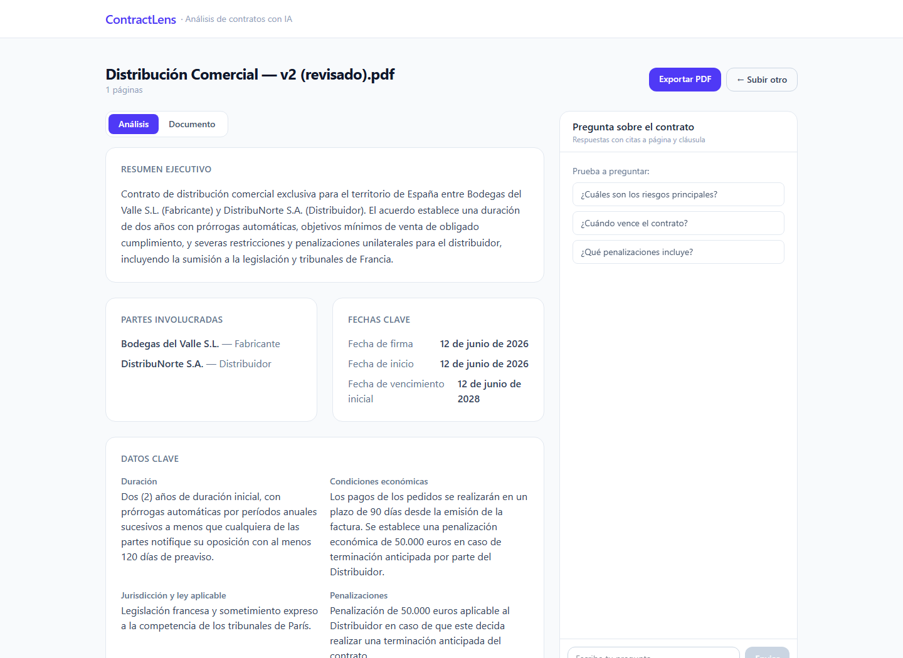
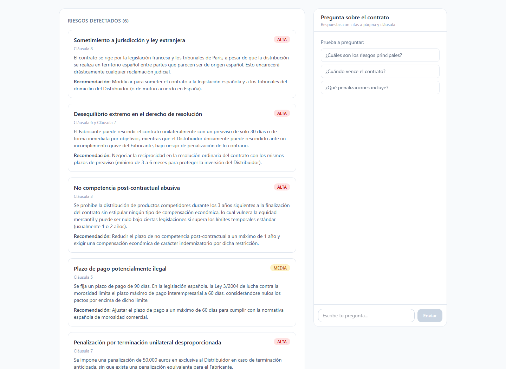
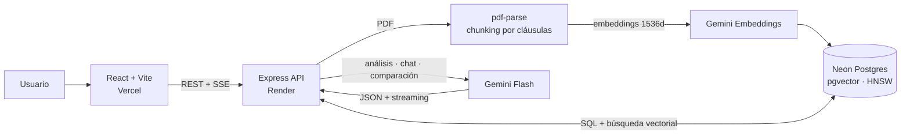

# ContractLens

[](https://github.com/marwix127/ContractLens/actions/workflows/ci.yml)

> Asistente de análisis de contratos con IA. Convierte un PDF en una vista estructurada con resumen ejecutivo, datos clave, riesgos por severidad y un chat con citas a página y cláusula.

**Problema que resuelve:** centraliza la primera lectura de un contrato para que
despachos pequeños y pymes localicen antes las partes, fechas, obligaciones y
cláusulas que merecen una revisión profesional.

---

## Demo

[Demo en vivo](https://contract-lens-mwx.vercel.app) ·
[API REST](https://contractlens-api-o8wt.onrender.com) ·
[Estado del servicio](https://contractlens-api-o8wt.onrender.com/health)

La demo pública conecta Vercel con la API de Render y PostgreSQL + pgvector en
Neon. Incluye cinco contratos ficticios precargados para recorrer el producto
sin subir documentación propia.

> ⚠️ ContractLens proporciona un análisis automatizado con fines informativos. **No sustituye el asesoramiento de un profesional legal.**

---

## Producto en acción

[](https://contract-lens-mwx.vercel.app)

_Resumen ejecutivo, partes, fechas, condiciones clave y chat RAG en una sola vista._

[](https://contract-lens-mwx.vercel.app)

_Cada riesgo conserva su ubicación, explicación, severidad y recomendación._

[Ver la portada](docs/images/contractlens-home.png) ·
[Ver el visor del documento](docs/images/contractlens-document.png)

Todas las capturas utilizan contratos ficticios incluidos en la demo pública.

---

## Arquitectura



- **Ingesta:** PDF → extracción por páginas → chunking estructural → embeddings → pgvector.
- **Consulta:** pregunta → recuperación _top-k_ → Gemini → respuesta SSE con citas.

---

## Stack técnico

**Backend** — Node.js + Express
- `pg` + extensión **pgvector** — Postgres con búsqueda vectorial
- `pdf-parse` (v2) — extracción de texto página a página
- `@google/genai` — embeddings, análisis y chat con Gemini
- `multer` — subida de archivos en memoria

**Frontend** — React 19 + Vite + Tailwind CSS 4
- `react-pdf` — visor de PDF integrado (carga diferida)

**Infraestructura**
- PostgreSQL + pgvector reproducible en local mediante **Docker Compose**
- Backend desplegable en **Render** con el runtime nativo de Node.js
- PostgreSQL administrado en **Neon** con conexión agrupada y TLS
- Frontend publicado en **Vercel**
- Variables de entorno separadas para local (`.env.local`) y despliegue

**Modelos (Gemini)**
- Embeddings: `gemini-embedding-001` (1536 dimensiones)
- Análisis, chat y comparación: `gemini-3.5-flash` con **fallback** automático a `gemini-3-flash-preview` y `gemini-2.5-flash`

---

## Decisiones técnicas

Estas son las decisiones que diferencian el proyecto de un tutorial:

- **Un solo proveedor (Gemini) para embeddings, análisis y chat.** Simplifica la operación y aprovecha un único origen de cuota/credenciales. Cada tarea está aislada en su propio servicio, lo que reduce el acoplamiento si más adelante cambia el modelo o el proveedor.

- **pgvector en vez de una base vectorial dedicada (Pinecone, etc.).** Para este volumen, mantener los vectores junto a los datos relacionales en Postgres elimina una pieza de infraestructura, simplifica los _joins_ (chunk ↔ contrato) y abarata el despliegue. Índice `HNSW` con distancia coseno, que puede crearse antes de cargar datos y ofrece buen recall para un conjunto pequeño e incremental.

- **Embeddings a 1536 dimensiones y normalizados manualmente.** `gemini-embedding-001` produce 3072 dimensiones por defecto, pero el tipo `vector` indexado con HNSW admite hasta 2000. Se solicita `outputDimensionality: 1536`; como Gemini no normaliza los vectores al truncarlos, se normalizan en código para que la distancia coseno sea correcta. (`taskType` diferenciado: `RETRIEVAL_DOCUMENT` al indexar, `RETRIEVAL_QUERY` al preguntar.)

- **Chunking estructural por cláusulas, no solo por tamaño fijo.** Se detectan encabezados de cláusula/artículo con expresiones regulares y se parte el texto en esos límites, conservando **número de página y referencia de cláusula** en cada chunk. Esto permite devolver citas trazables en el chat. Las cláusulas muy largas se subdividen con solapamiento.

- **Structured output (JSON por schema) en el análisis.** El análisis inicial solicita a Gemini un JSON conforme a un esquema, evitando extraer datos de una respuesta de texto libre.

- **RAG con citas, manejo de "no lo sé", historial y streaming.** El chat recupera los fragmentos más relevantes, responde citando página y cláusula, indica cuándo la respuesta no está en el documento para reducir respuestas fuera de contexto, mantiene el historial y emite la respuesta por **Server-Sent Events**.

- **Cadena de modelos con fallback.** Si el modelo principal devuelve un 429 o 503 se pasa automáticamente al siguiente de la cadena. Para el 503 se reintenta con _backoff_ antes de saltar; para el 429 se salta de inmediato. Esto mejora la resiliencia ante saturación o cuota, aunque no garantiza disponibilidad si fallan todos los modelos. El mecanismo se comparte entre análisis, chat y comparación.

- **Protección de la demo pública.** Las subidas y todas las operaciones con Gemini comparten límites por IP, además de cuotas globales de ráfaga y diarias y un máximo de tres operaciones de IA concurrentes. Las respuestas `429` publican cabeceras `RateLimit` y `Retry-After`; `/health` queda excluido y cachea brevemente su comprobación de Neon. Los PDFs se limitan a 5 MB y 100 páginas, las preguntas a 2.000 caracteres y los análisis ya guardados se reutilizan sin gastar la cuota global.

- **Comparación de versiones.** Dos contratos → una llamada con structured output que devuelve los cambios (añadido/eliminado/modificado con impacto y valores antes/después) y cómo cambia el perfil de riesgo.

---

## Calidad y CI

La suite levanta la misma aplicación Express sobre un puerto efímero, pero
inyecta una base de datos y servicios de IA simulados. Comprueba CORS,
health/readiness, límites JSON y multipart, privacidad del listado, análisis
cacheado, descarga Unicode, limpieza tras una ingesta fallida, SSE y rate
limiting sin necesitar secretos ni consumir cuota externa.

GitHub Actions ejecuta en paralelo los tests del backend y el build de
producción del frontend con Node 22 en cada push y pull request a `master`.
El resultado actual se publica en el badge situado al inicio del README.

---

## Estructura del proyecto

```
ContractLens/
├── .github/workflows/ci.yml # tests y build automáticos en GitHub Actions
├── compose.yaml              # PostgreSQL + pgvector para desarrollo local
├── index.js                  # composición y ciclo de vida del servidor
├── src/
│   ├── app.js                # fábrica Express testeable sin abrir puertos
│   ├── db.js                 # pool de conexión a Postgres
│   ├── http/                 # headers, límites y control de concurrencia
│   ├── routes/contracts.js   # endpoints
│   └── services/
│       ├── gemini.js         # cliente Gemini con inicialización diferida
│       ├── embeddings.js     # Gemini embeddings (normalizados)
│       ├── chunking.js       # chunking por cláusulas
│       ├── ingest.js         # pipeline chunks → embeddings → pgvector
│       ├── analysis.js       # análisis inicial (structured output)
│       ├── chat.js           # RAG: retrieval + respuesta (normal y streaming)
│       └── retry.js          # reintentos con backoff para Gemini
├── migrations/               # schema y migraciones
├── test/                     # pruebas unitarias e integración HTTP
├── seed/
│   ├── seed-samples.js       # muestras completas generadas con Gemini
│   └── seed-local.js         # datos QA deterministas sin consumir Gemini
└── frontend/                 # React + Vite + Tailwind
    └── src/
        ├── api.js
        └── components/       # UploadScreen, ContractView, Dashboard, ChatPanel, PdfViewer
```

---

## Puesta en marcha

### Requisitos

- Node.js 22 LTS (22.12+)
- Docker Desktop con Docker Compose (opción local recomendada)
- Una API key de Gemini ([Google AI Studio](https://aistudio.google.com/apikey))
  solo para subida, embeddings, análisis, chat y comparación reales

### Opción recomendada: backend local con Docker

```bash
npm install
cp .env.local.example .env.local

# PostgreSQL 16 con pgvector (publicado en localhost:5433)
npm run local:db:up

# Crear el esquema y dos contratos deterministas para QA
npm run local:migrate
npm run local:seed

# API en http://localhost:3000
npm run local:dev
```

En PowerShell utiliza `Copy-Item` para crear la configuración:

```powershell
Copy-Item .env.local.example .env.local
```

En otra terminal, inicia el frontend:

```bash
cd frontend
npm install
npm run dev
```

La aplicación queda disponible en `http://localhost:5173`; Vite reenvía las
peticiones de `/contracts` al backend de `http://localhost:3000`.

Comprobaciones:

```text
GET http://localhost:3000/          -> proceso Express disponible
GET http://localhost:3000/health    -> Express y PostgreSQL disponibles
GET http://localhost:3000/contracts/samples
```

El seed local no consume cuota de Gemini y deja preparados el listado, el
dashboard, el visor y la exportación PDF. Para subir nuevos contratos, usar el
chat o comparar versiones con IA, hay que completar `GEMINI_API_KEY` en
`.env.local`. Los contratos del seed local no contienen embeddings; para probar
el chat RAG completo hay que subir un PDF con una clave configurada.

### Configuración manual o remota

También se puede usar cualquier PostgreSQL que tenga la extensión `pgvector`.
Crea un `.env` con `DATABASE_URL`, `GEMINI_API_KEY`, `PORT` y `FRONTEND_URL`, y
ejecuta:

```bash
npm run migrate
npm run db:check
npm run seed
npm run dev
```

`npm run seed` genera las muestras completas y sí realiza llamadas a Gemini.

### Scripts útiles

- `npm test` — ejecuta toda la suite sin conectarse a Neon ni llamar a Gemini
- `npm run test:unit` — pruebas unitarias de headers y rate limiting
- `npm run test:integration` — API Express completa con DB/IA simuladas
- `npm run local:db:up` — levanta PostgreSQL + pgvector local
- `npm run local:migrate` — aplica el esquema a la base local
- `npm run local:seed` — crea datos QA deterministas sin Gemini
- `npm run local:dev` — inicia el backend local con recarga automática
- `npm run migrate:hnsw` — actualiza una base anterior del índice IVFFlat a HNSW
- `npm run db:reset` — vacía todos los datos de la base configurada
- `npm run seed` — regenera las muestras completas usando Gemini

Para detener la base de datos:

```bash
npm run local:db:down
```

Los datos permanecen en el volumen `contractlens_pgdata`. El comando
`docker compose down -v` elimina también ese volumen y debe usarse solo si se
quiere reiniciar la base local desde cero.

---

## Despliegue

El despliegue objetivo mantiene el frontend en **Vercel**, ejecuta la API
Express en **Render** y utiliza **Neon** para PostgreSQL + pgvector.

### 1. Base de datos en Neon

1. Crea un proyecto de Neon en una región europea próxima a Frankfurt.
2. Desde **Connect**, copia primero la URL directa para ejecutar migraciones.
3. Copia `.env.example` como `.env`, sustituye `DATABASE_URL` por esa URL y
   completa el resto de variables.
4. Fuerza el uso de ese archivo porque `.env.local` tiene prioridad en
   desarrollo:

```bash
ENV_FILE=.env npm run migrate
ENV_FILE=.env npm run db:check
```

En PowerShell:

```powershell
$env:ENV_FILE='.env'
npm.cmd run migrate
npm.cmd run db:check
```

La migración activa `vector` y crea el esquema completo. Para la API desplegada,
utiliza la URL **pooled** de Neon y conserva sus parámetros de seguridad. Si
Neon entrega `sslmode=require`, la configuración lo normaliza a
`sslmode=verify-full` antes de crear el pool.

### 2. Backend en Render

El repositorio incluye `render.yaml`, por lo que la configuración queda
versionada y no depende de introducir manualmente los comandos del servicio.

1. En Render, selecciona **New > Blueprint** y conecta este repositorio.
2. Render detectará `render.yaml`; revisa el servicio `contractlens-api` y
   confirma el plan **Free** y la región **Frankfurt**.
3. Cuando Render lo solicite, configura los dos secretos:

```text
DATABASE_URL=<URL pooled de Neon>
GEMINI_API_KEY=<clave de Google AI Studio>
```

El Blueprint fija `NODE_ENV`, `FRONTEND_URL`, Node 22, `npm ci`, `npm start` y
el health check `/health`. Render proporciona `PORT` automáticamente. No uses la
base de datos de Render: la aplicación debe seguir conectada a la URL **pooled**
de Neon.

### 3. Frontend en Vercel

- **Root Directory:** `frontend` (preset Vite, autodetectado).
- Variable de entorno:
  - `VITE_API_BASE` — dominio `https://...onrender.com` del backend, sin barra final.

La variable se incorpora durante el build. Después de cambiarla hay que
redesplegar el frontend y verificar `/health`, la lista de ejemplos y CORS.

---

## API

| Método | Ruta | Descripción |
|--------|------|-------------|
| `GET`  | `/health` | Comprueba que la API y PostgreSQL están disponibles |
| `POST` | `/contracts` | Sube un PDF (campo `file`): extrae texto, chunking e indexado |
| `GET`  | `/contracts` | Lista solo las muestras; `.env.local.example` habilita el listado local completo |
| `GET`  | `/contracts/samples` | Lista los contratos de muestra |
| `GET`  | `/contracts/:id` | Detalle de un contrato |
| `GET`  | `/contracts/:id/file` | Sirve el PDF original |
| `POST` | `/contracts/:id/analyze` | Genera y guarda el análisis (Gemini) |
| `GET`  | `/contracts/:id/analysis` | Devuelve el análisis guardado |
| `GET`  | `/contracts/:id/analysis/pdf` | Descarga el análisis como informe PDF |
| `POST` | `/contracts/:id/chat` | Pregunta sobre el contrato (respuesta completa) |
| `POST` | `/contracts/:id/chat/stream` | Igual, con respuesta en streaming (SSE) |
| `POST` | `/contracts/compare` | Compara dos versiones (`fromId`, `toId`) |

---

## Limitaciones conocidas

- La instancia gratuita de Render se suspende tras 15 minutos sin tráfico y
  puede tardar cerca de un minuto en responder a la primera petición. Neon
  también puede reactivarse bajo demanda; los PDFs grandes pueden exceder el
  tiempo disponible para una única petición síncrona.
- La demo es compartida y todavía no tiene autenticación ni aislamiento por
  usuario. El listado público solo devuelve las muestras y hay rate limiting,
  pero los documentos subidos permanecen almacenados. No se deben usar contratos
  reales o confidenciales; antes de un uso comercial hacen falta cuentas y una
  política de retención/borrado.
- Los contadores del rate limiting son una protección _best effort_: viven en
  memoria porque la demo utiliza una única instancia y se reinician cuando
  Render suspende, reinicia o redespliega el servicio. Para proteger presupuesto
  real o escalar habría que moverlos a un almacén compartido y persistente.
- Las cuotas de Gemini dependen del modelo, el proyecto y el _tier_. Cuando un
  intento devuelve 429, la cadena de fallback prueba el siguiente modelo. Los
  análisis guardados se reutilizan; subir un PDF nuevo, conversar o comparar
  versiones sí consume recursos de IA.
- El chunking por expresiones regulares está optimizado para contratos en español bien estructurados (Cláusula/Artículo/Estipulación).
- Los PDFs escaneados sin OCR no tienen texto extraíble y se rechazan con un aviso.

---
