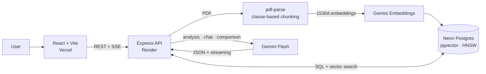

# ContractLens

[](https://github.com/marwix127/ContractLens/actions/workflows/ci.yml)

**English** · [Español](README.es.md)

Contract analysis assistant. It turns a PDF into a structured view: executive
summary, key facts, risks sorted by severity, and a chat that answers citing the
page and clause it took the answer from.

The idea is to centralise the first read of a contract, so a small firm can see
the parties, dates, obligations and the clauses worth a professional review
without going through the whole document first.

## Demo

[Live demo](https://contract-lens-mwx.vercel.app) ·
[REST API](https://contractlens-api-o8wt.onrender.com) ·
[Service status](https://contractlens-api-o8wt.onrender.com/health)

The public demo runs the frontend on Vercel, the API on Render and PostgreSQL +
pgvector on Neon. It comes with five fictional contracts already loaded, so you
can go through the product without uploading anything of your own.

**ContractLens produces automated analysis for informational purposes. It is not
a substitute for advice from a legal professional.**

## Screenshots

[](https://contract-lens-mwx.vercel.app)

Executive summary, parties, dates, key terms and the RAG chat in a single view.

[](https://contract-lens-mwx.vercel.app)

Each risk keeps its location, explanation, severity and recommendation.

There are two more: the [landing page](docs/images/contractlens-home.png) and the
[document viewer](docs/images/contractlens-document.png). All of them use the
fictional contracts bundled with the demo.

## Architecture



On ingestion, the PDF is extracted page by page, split into chunks along clause
boundaries, embedded and stored in pgvector. On a question, the top-k chunks are
retrieved and handed to Gemini, which streams back an answer with citations.

## Tech stack

**Backend**, Node.js and Express:

- `pg` with the **pgvector** extension, for vector search inside Postgres
- `pdf-parse` (v2) to extract the text page by page
- `@google/genai` for embeddings, analysis and chat
- `multer` to handle uploads in memory

**Frontend**, React 19 with Vite and Tailwind CSS 4, plus `react-pdf` for the
built-in viewer (loaded lazily).

**Infrastructure**:

- Docker Compose to reproduce PostgreSQL + pgvector locally
- Render for the API, on the native Node.js runtime
- Neon for managed PostgreSQL, with connection pooling and TLS
- Vercel for the frontend
- Separate environment files for local work (`.env.local`) and deployment

**Gemini models**: `gemini-embedding-001` at 1536 dimensions for embeddings, and
`gemini-3.5-flash` for analysis, chat and comparison, falling back to
`gemini-3-flash-preview` and `gemini-2.5-flash`.

## Technical decisions

**One provider for everything.** Embeddings, analysis and chat all go through
Gemini, so there is a single source of quota and credentials to manage. Each
task still lives in its own service, which keeps the swap cheap if the model or
the provider changes.

**pgvector instead of a dedicated vector database.** At this volume, keeping the
vectors next to the relational data removes a piece of infrastructure and makes
the chunk-to-contract joins trivial. The index is HNSW with cosine distance: it
can be created before any data is loaded and gives good recall on a small
dataset that grows incrementally.

**1536 dimensions, normalised by hand.** `gemini-embedding-001` returns 3072
dimensions by default, but a `vector` column indexed with HNSW tops out at 2000.
The service asks for `outputDimensionality: 1536`, and since Gemini does not
renormalise a truncated vector, the normalisation happens in code so cosine
distance stays meaningful. Indexing uses `RETRIEVAL_DOCUMENT` as `taskType` and
questions use `RETRIEVAL_QUERY`.

**Chunking by clause, not only by size.** Clause and article headings are
detected with a regex and the text is cut at those boundaries, keeping the page
number and the clause reference on every chunk. That is what the chat cites
later. Clauses that are too long get subdivided with overlap.

**Structured output for the analysis.** The initial analysis asks Gemini for
JSON against a schema instead of parsing data out of free text.

**RAG with citations and an explicit "I don't know".** The chat retrieves the
most relevant fragments and answers citing page and clause. When the answer is
not in the document it says so, which cuts down on invented replies. It keeps
the conversation history and streams over Server-Sent Events.

**A chain of models with fallback.** On a 429 or a 503 the request moves to the
next model in the chain. A 503 gets a retry with backoff first, since it usually
means overload; a 429 means the quota is gone, so retrying the same model is
pointless and it jumps straight away. Analysis, chat and comparison share the
mechanism. It helps under saturation, but it cannot save you if every model in
the chain fails.

**Limits on the public demo.** Uploads and every Gemini call share per-IP limits,
on top of global burst and daily quotas and a cap of three concurrent AI
operations. A `429` comes back with `RateLimit` and `Retry-After` headers.
`/health` is excluded and caches its Neon check briefly. PDFs are capped at 5 MB
and 100 pages, questions at 2000 characters, and an analysis that is already
stored is reused instead of spending quota again.

**Version comparison.** Two contracts go into a single structured-output call
that returns the changes, each one marked as added, removed or modified with its
impact and its before/after values, plus how the risk profile shifts.

## Quality and CI

The suite boots the same Express app on an ephemeral port, but with a fake
database and fake AI services injected. It covers CORS, health and readiness,
JSON and multipart limits, listing privacy, cached analysis, Unicode downloads,
cleanup after a failed ingestion, SSE and rate limiting. No secrets, and no
external quota is consumed.

GitHub Actions runs the backend tests and the production frontend build in
parallel on Node 22, on every push and pull request to `master`.

## Project structure

```
ContractLens/
├── .github/workflows/ci.yml  # tests and build on GitHub Actions
├── compose.yaml              # PostgreSQL + pgvector for local development
├── index.js                  # server composition and lifecycle
├── src/
│   ├── app.js                # Express factory, testable without opening ports
│   ├── db.js                 # Postgres connection pool
│   ├── http/                 # headers, limits and concurrency control
│   ├── routes/contracts.js   # endpoints
│   └── services/
│       ├── gemini.js         # Gemini client, created on first use
│       ├── embeddings.js     # Gemini embeddings, normalised
│       ├── chunking.js       # clause-based chunking
│       ├── ingest.js         # chunks, embeddings and insert into pgvector
│       ├── analysis.js       # initial analysis with structured output
│       ├── chat.js           # RAG retrieval and answer, plain and streaming
│       └── retry.js          # model fallback and backoff for Gemini
├── migrations/               # schema and migrations
├── test/                     # unit tests and HTTP integration tests
├── seed/
│   ├── seed-samples.js       # full samples, generated with Gemini
│   └── seed-local.js         # deterministic QA data, no Gemini calls
└── frontend/                 # React + Vite + Tailwind
    └── src/
        ├── api.js
        └── components/       # UploadScreen, ContractView, Dashboard, ChatPanel, PdfViewer
```

## Getting started

You need Node.js 22 LTS (22.12+) and Docker Desktop with Docker Compose for the
local option. A [Gemini API key](https://aistudio.google.com/apikey) is only
needed for real uploads, embeddings, analysis, chat and comparison.

### Local backend with Docker

```bash
npm install
cp .env.local.example .env.local

# PostgreSQL 16 with pgvector, published on localhost:5433
npm run local:db:up

# Schema plus two deterministic contracts for QA
npm run local:migrate
npm run local:seed

# API on http://localhost:3000
npm run local:dev
```

On PowerShell, use `Copy-Item` for the config file:

```powershell
Copy-Item .env.local.example .env.local
```

In another terminal, start the frontend:

```bash
cd frontend
npm install
npm run dev
```

The app comes up on `http://localhost:5173`, and Vite proxies `/contracts` to
the backend on port 3000. To check things are wired up:

```text
GET http://localhost:3000/          -> Express is running
GET http://localhost:3000/health    -> Express and PostgreSQL are running
GET http://localhost:3000/contracts/samples
```

The local seed spends no Gemini quota and leaves the listing, the dashboard, the
viewer and the PDF export ready to use. Uploading new contracts, using the chat
or comparing versions needs `GEMINI_API_KEY` in `.env.local`. Note that the
seeded contracts carry no embeddings, so to try the full RAG chat you have to
upload a PDF with a key configured.

### Manual or remote setup

Any PostgreSQL with the `pgvector` extension works too. Create a `.env` with
`DATABASE_URL`, `GEMINI_API_KEY`, `PORT` and `FRONTEND_URL`, then run:

```bash
npm run migrate
npm run db:check
npm run seed
npm run dev
```

Careful with `npm run seed`: it generates the full samples and does call Gemini.

### Scripts

| Script | What it does |
|--------|--------------|
| `npm test` | The whole suite, without Neon and without calling Gemini |
| `npm run test:unit` | Unit tests for headers and rate limiting |
| `npm run test:integration` | Full Express API with fake DB and AI |
| `npm run local:db:up` | Starts the local PostgreSQL + pgvector |
| `npm run local:migrate` | Applies the schema to the local database |
| `npm run local:seed` | Deterministic QA data, no Gemini |
| `npm run local:dev` | Local backend with auto-reload |
| `npm run migrate:hnsw` | Moves an older database from IVFFlat to HNSW |
| `npm run db:reset` | Wipes all data from the configured database |
| `npm run seed` | Regenerates the full samples using Gemini |

`npm run local:db:down` stops the database. The data stays in the
`contractlens_pgdata` volume; `docker compose down -v` removes that volume too,
so only use it when you want to start the local database from scratch.

## Deployment

The target setup keeps the frontend on Vercel, the Express API on Render and
PostgreSQL + pgvector on Neon.

### 1. Database on Neon

1. Create a Neon project in a European region close to Frankfurt.
2. In **Connect**, copy the direct URL first. That is the one for migrations.
3. Copy `.env.example` to `.env`, put that URL in `DATABASE_URL` and fill in the
   rest of the variables.
4. Point to that file explicitly, because `.env.local` wins in development:

```bash
ENV_FILE=.env npm run migrate
ENV_FILE=.env npm run db:check
```

On PowerShell:

```powershell
$env:ENV_FILE='.env'
npm.cmd run migrate
npm.cmd run db:check
```

The migration enables `vector` and creates the schema. For the deployed API use
Neon's **pooled** URL and keep its security parameters. If Neon hands out
`sslmode=require`, the config normalises it to `sslmode=verify-full` before
creating the pool.

### 2. Backend on Render

The repository ships a `render.yaml`, so the service configuration is versioned
and there is nothing to type in by hand.

1. In Render, pick **New > Blueprint** and connect this repository.
2. Render detects `render.yaml`. Review the `contractlens-api` service and
   confirm the **Free** plan and the **Frankfurt** region.
3. When Render asks, set the two secrets:

```text
DATABASE_URL=<Neon pooled URL>
GEMINI_API_KEY=<Google AI Studio key>
```

The Blueprint pins `NODE_ENV`, `FRONTEND_URL`, Node 22, `npm ci`, `npm start`
and the `/health` health check, and Render provides `PORT` on its own. Do not
use Render's own database: the app stays on Neon's pooled URL.

### 3. Frontend on Vercel

Set the root directory to `frontend` (the Vite preset is autodetected) and add
one environment variable, `VITE_API_BASE`, with the backend's
`https://...onrender.com` domain and no trailing slash. It is baked in at build
time, so after changing it you have to redeploy and then check `/health`, the
samples list and CORS.

## API

| Method | Route | Description |
|--------|-------|-------------|
| `GET`  | `/health` | Checks that the API and PostgreSQL are up |
| `POST` | `/contracts` | Uploads a PDF in the `file` field, then extracts, chunks and indexes it |
| `GET`  | `/contracts` | Samples only; `.env.local.example` enables the full local listing |
| `GET`  | `/contracts/samples` | Lists the sample contracts |
| `GET`  | `/contracts/:id` | Contract details |
| `GET`  | `/contracts/:id/file` | Serves the original PDF |
| `POST` | `/contracts/:id/analyze` | Generates and stores the analysis |
| `GET`  | `/contracts/:id/analysis` | Returns the stored analysis |
| `GET`  | `/contracts/:id/analysis/pdf` | Downloads the analysis as a PDF report |
| `POST` | `/contracts/:id/chat` | Asks about the contract, full response |
| `POST` | `/contracts/:id/chat/stream` | The same, streamed over SSE |
| `POST` | `/contracts/compare` | Compares two versions, `fromId` and `toId` |

## Known limitations

Render's free instance sleeps after 15 minutes without traffic and can take
close to a minute to answer the first request. Neon may also have to wake up,
and a large PDF can outlast the time available for a single synchronous request.

The demo is shared and has no authentication or per-user isolation yet. The
public listing only returns the samples and there is rate limiting, but uploaded
documents stay stored. Do not use real or confidential contracts; commercial use
would need accounts and a retention and deletion policy first.

The rate limiting counters are best effort. They live in memory, because the
demo runs on a single instance, and they reset whenever Render suspends,
restarts or redeploys the service. Protecting a real budget, or scaling past one
instance, would mean moving them to a shared persistent store.

Gemini quotas depend on the model, the project and the tier. When an attempt
returns 429 the fallback chain tries the next model. Stored analyses are reused,
but uploading a PDF, chatting or comparing versions does spend AI resources.

The regex chunking is tuned for well-structured Spanish contracts
(Cláusula/Artículo/Estipulación), and scanned PDFs without OCR have no
extractable text, so they are rejected with a notice.
